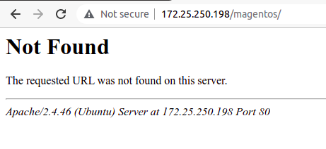

## Some Security Tips.( If you know more then please contribute on this repo )

### Tip1 - If we type wrong url on our website by default it shows our ip and os and apache version as shown in diagram




so its time to hide IP , OS and Apache Version

#### Edit - 

```console
ritik@ritik:~$ sudo vim /etc/apache2/conf-enabled/security.conf

		ServerTokens Prod
		ServerSignature Off
```

After that your web page looks like this -


