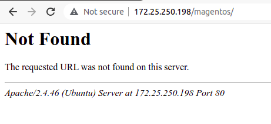
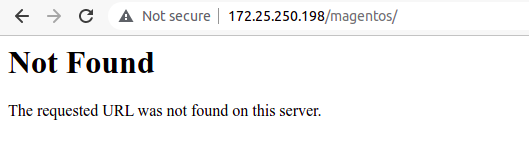
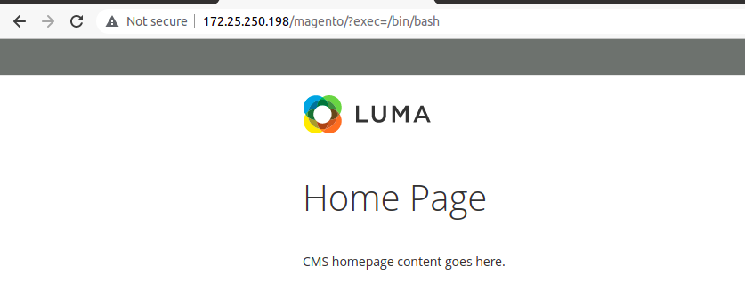
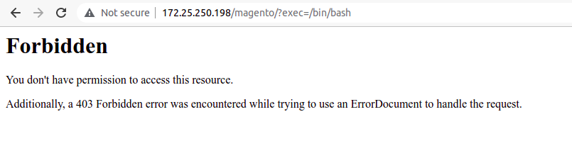

# Some Security Tips.( If you know more then please contribute on this repo )

## Tip1 - If we type wrong url on our website by default it shows our ip and os and apache version as shown in diagram




so its time to hide IP , OS and Apache Version

### Edit - 

```console
ritik@ritik:~$ sudo vim /etc/apache2/conf-enabled/security.conf

		ServerTokens Prod
		ServerSignature Off
```

After that your web page looks like this -



## Tip2 - Use Mod Security Rules to protect website from malicious queries and other attacks



## Now add some rules to protect website from this types of attacks 

## Install modsecurity
```console
ritik@ritik:~$ sudo apt install libapache2-mod-security2 -y
ritik@ritik:~$ sudo a2enmod headers
ritik@ritik:~$ sudo systemctl restart apache2
```

### Now use OWASP ModSecurity Core Rules for more details visit official website [Click Here](https://owasp.org/www-project-modsecurity-core-rule-set/)

### To download latest OWASP rules visit [official website](https://coreruleset.org/installation/) else folllow below steps -

### First we remove default modsecurity rule and add new OWASP rules

```console
ritik@ritik:~$ sudo rm -rf  /usr/share/modsecurity-crs/
ritik@ritik:~$ sudo git clone https://github.com/coreruleset/coreruleset /usr/share/modsecurity-crs/
```
### To activate conf file, remove .example

```console
ritik@ritik:~$ sudo mv /usr/share/modsecurity-crs/crs-setup.conf.example /usr/share/modsecurity-crs/crs-setup.conf
```

### Also activate SecRuleEngine, by default it is DetectionOnly which means it only detect malicious query, So make it On so that it block malicious query  

```console
ritik@ritik:~$ sudo mv /etc/modsecurity/modsecurity.conf-recommended /etc/modsecurity/modsecurity.conf
ritik@ritik:~$ sudo vim  /etc/modsecurity/modsecurity.conf
			
			SecRuleEngine On
```

### Now enable or add modsecurity files in apache2 conf file 

```console
ritik@ritik:~$ sudo vim /etc/apache2/apache2.conf

			<IfModule security2_module>
       				 Include /usr/share/modsecurity-crs/crs-setup.conf
       				 Include /usr/share/modsecurity-crs/rules/*.conf
			</IfModule>
```

### Also make entry on your enabled virtual host files

```console
ritik@ritik:~$ sudo vim /etc/apache2/sites-enabled/000-default.conf
			
			SecRuleEngine On
        		<IfModule security2_module>
                		Include /usr/share/modsecurity-crs/crs-setup.conf
                		Include /usr/share/modsecurity-crs/rules/*.conf
        		</IfModule>
```

### Restart apache2 service

```console
ritik@ritik:~$ sudo systemctl restart apache2
```

## Now when attacker try to exec malicious query so your website block it as shown in below image




